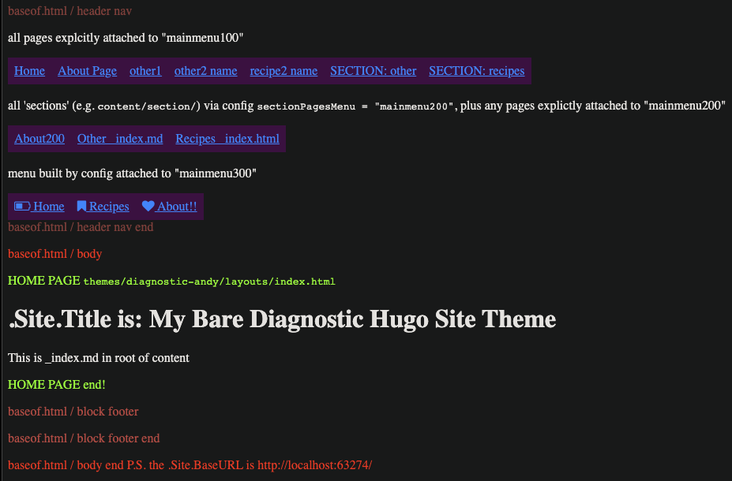
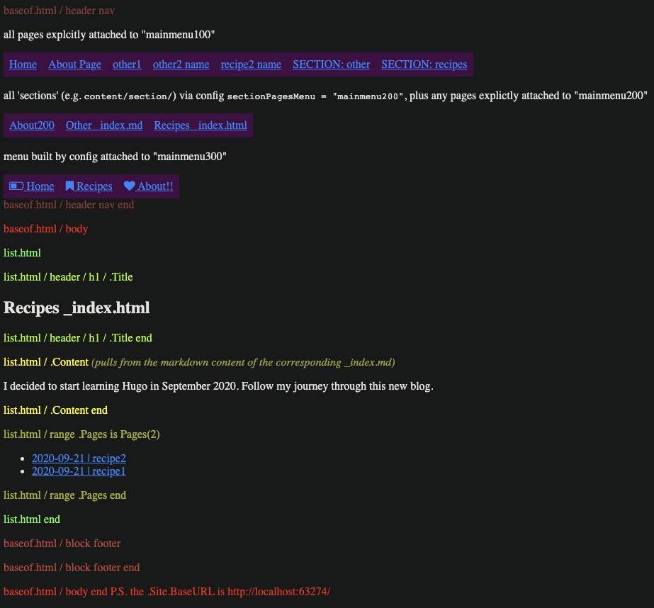
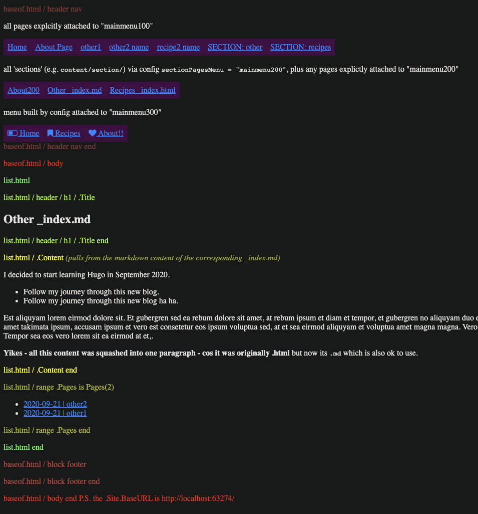

# Hugo Bare 1 

An example `hugo` site using a custom theme called `diagnostic-andy` which prints diagnostic html showing where each piece of template content comes from.

There is also some experimentation re the generation of menus, using three different techniques.

Visit this site at https://github.com/abulka/hugo-bare1 

## Screenshots

### Home

### List

### Single content

